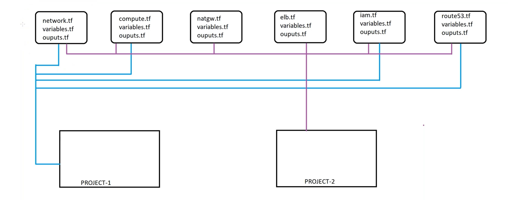

---

# Terraform Modular AWS Infrastructure





## Overview

This repository contains a **modular Terraform implementation** used to provision basic AWS infrastructure components.
The goal of this project was to **understand how Terraform modules work**, how infrastructure can be split into logical units, and how these modules can be reused from a root configuration.

The implementation focuses on **structure and learning**, rather than covering all AWS services.

---

## Repository Structure

The project is organized using **Terraform modules**, each responsible for a specific part of the infrastructure.

```
terraform-mod/
├── development/
├── modules/
│   ├── network/
│   ├── compute/
│   ├── elb/
│   ├── nat/
│   ├── iam/
│   └── sg/
```

---

## Implemented Modules

### Network Module

* VPC creation
* Public subnets
* Private subnets
* Route tables and routing
* Use of locals, variables, and outputs

---

### Compute Module

* EC2 instances in public subnets
* EC2 instances in private subnets
* Use of variables and locals for configuration

---

### ELB Module

* Application Load Balancer
* Listener configuration
* Output values for integration with other modules

---

### NAT Module

* NAT Gateway creation
* Supporting resources for private subnet outbound access

---

### IAM Module

* IAM roles
* Instance profiles for EC2

---

### Security Group Module

* Security group definitions
* Outputs for reuse in other modules

---

## Terraform Concepts Used

Through this implementation, I practiced:

* Creating and using **Terraform modules**
* Passing data between modules using **inputs and outputs**
* Using **variables** to avoid hardcoding values
* Using **locals** for cleaner configurations
* Organizing Terraform files by responsibility
* Understanding Terraform’s **dependency handling** between modules

---

## Purpose of This Project

This project was created to:

* Learn how to **structure Terraform code using modules**
* Understand how different infrastructure components connect
* Practice reusable and readable Terraform configurations
* Prepare for larger multi-module Terraform projects

---

## How It Is Used

* Modules are defined under the `modules/` directory
* The root configuration (development folder) calls only the required modules
* Each module can be reused independently by other projects

---

## Notes

* This is a **learning-focused implementation**
* Only the modules shown in the repository are implemented
* The project can be extended with additional modules if needed

---
